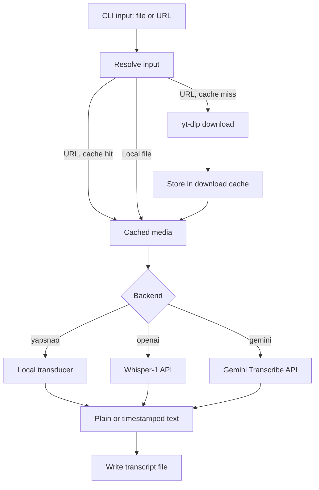
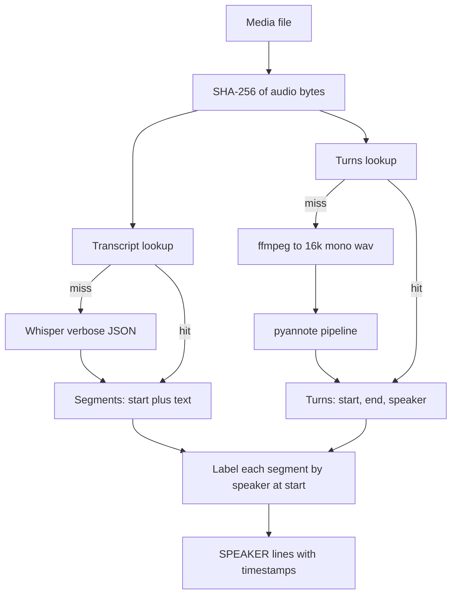
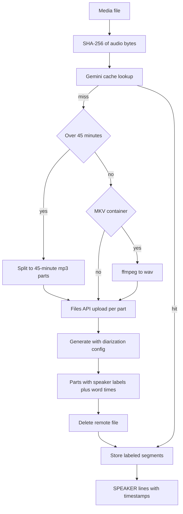
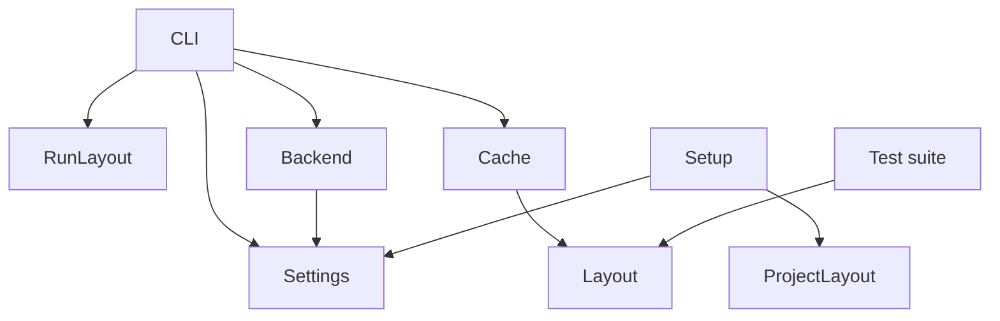
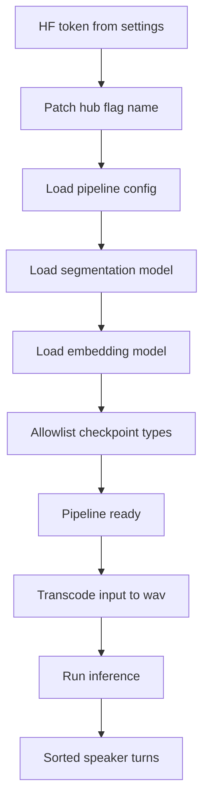

# How audio-transcribe works

Concepts first, then pipeline diagrams.
All paths below come from `layout.py` instances.

## Concepts

**Backend** is the transcription engine.
`yapsnap` runs offline on your CPU and handles English only.
`openai` calls Whisper-1 in the cloud and handles any language.
`gemini` calls Gemini Transcribe in the cloud and diarizes natively, with no local GPU pass.

**Transcription** turns audio into text.
**Timestamps** attach a start time to each segment.
**Diarization** splits audio into speaker turns, with no text.
**Labeling** joins the two: each text segment takes the speaker active at its start time.

**Cache** has three stores under one root.
Downloads map URL to media file.
Transcripts map audio content hash plus lang plus model to segments.
Turns map audio content hash plus speaker count to speaker turns.
A repeat run reuses all three and makes no network or API calls.

**Settings** is the only module that reads env.
**Layout** computes every path from explicit roots.
**Cache** does I/O against layout paths.
Backends take secrets as arguments and read no env.

## Run flow

## OpenAI with diarization

## Gemini with native diarization

## Module dependencies

## Diarization loading chain

